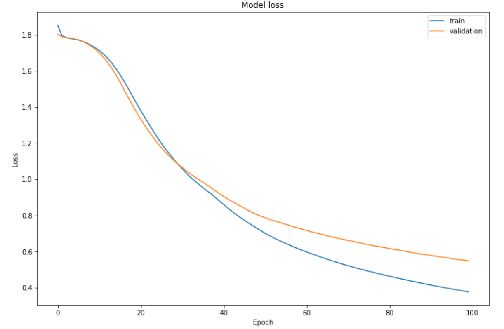

# Neural Networks

The following projects were adapted from various programming assignments from the Deep Learning Specialization courses by DeepLearning.AI offered on Coursera.  
https://www.coursera.org/specializations/deep-learning#courses

&nbsp;

## Deep Neural Network Cat Classification

  
  
  
  

  

&nbsp;

## Different Initialization Methods

&nbsp;

## Different Regularization Methods

&nbsp;

## Detailed Convolutional Neural Network Loss and Accuracy

  
  

  

&nbsp;

## YOLO Object Detection

  
  
  
  

 

&nbsp;

## U-Net Image Segmentation

&nbsp;

## Neural Style Transfer

&nbsp;

## LSTM Recurrent Neural Network Jazz Music Generation
https://youtu.be/IrWwjuxqZNI  
https://youtu.be/yjTL6ACa2OI

&nbsp;

## Attention Model Machine Translation and Attention Visualization

  
  

 

&nbsp;

## Trigger Word Detection Visualization

&nbsp;

## Debias Word Vectors

